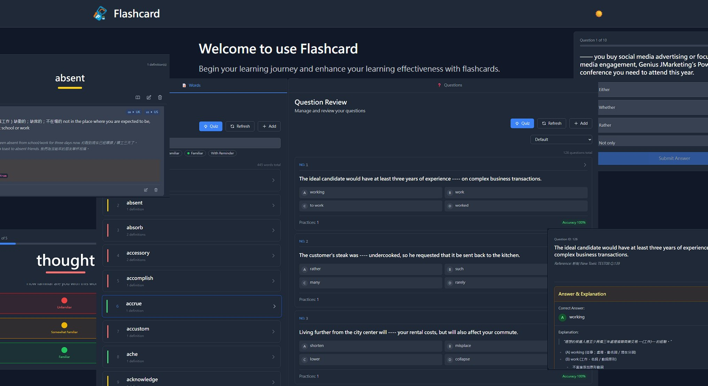

# Word Flashcard



A personal language learning app for building vocabulary and practising with quizzes. Manage your own word cards and custom questions, then test yourself to track your progress.

**Words**
- Add words with multiple definitions, part-of-speech tags, and pronunciation (UK/US audio)
- Look up a word in the Cambridge Dictionary and import its definitions and pronunciation in one click
- Mark familiarity level (Unfamiliar / Somewhat Familiar / Familiar) to reflect your current confidence
- Set reminders on words you want to revisit; clear them once you feel ready
- Filter your word list by familiarity level or by words that have active reminders
- Search words and browse with paginated results

**Questions**
- Create and manage multiple-choice questions (A / B / C / D) with a correct answer and explanation
- Track per-question statistics: practice count, error count, and accuracy rate
- Sort questions by familiarity (accuracy-based), practice count, or default order

**Quizzes**
- Start a word quiz with a configurable count and filter by familiarity level to focus on what you need most
- Start a question quiz from your custom multiple-choice question bank
- View your results after each quiz and choose to retake or return home

**Notes**
- Create and manage note cards with a title and markdown content
- Write rich notes using a markdown editor with live preview
- Reorder notes via drag-and-drop or move-up / move-down buttons
- Search notes and browse with paginated results

**Data Management**
- Export a full snapshot of all data (words, questions, notes, and their practice/answer history) to a JSON file from the header menu
- Restore all data from a previously exported JSON file, preserving original ids and timestamps (replaces all existing data)
- The server automatically writes a full backup to disk on startup and on a configurable interval, keeping a limited number of recent backups; this can be disabled entirely via `BACKUP_ENABLED`

## Project Structure

```
word-flashcard/
├── .claude/                       # Claude Code project configuration
│   └── commands/                 # Project-specific Claude Code custom commands (skills)
├── backups/                       # Automatic backup output (created at runtime, not committed)
├── data/                          # Database peers and models
│   ├── mocks/                    # Mock function for testing
│   ├── models/                   # Data models
│   ├── peers/                    # Database peers (query builders)
│   ├── schema/                   # Database schema definitions
│   └── registry.go               # Data model registry
├── dist/                          # Build output directory
├── docs/                          # Auto-generated Swagger API documentation
├── internal/                      # Internal application code
│   ├── controllers/              # API controllers
│   ├── middleware/               # HTTP middleware
│   ├── mocks/                    # Mock interfaces for testing
│   ├── models/                   # Data models
│   ├── routers/                  # Route configuration
│   └── scheduler/                # Background jobs (automatic backup scheduler)
├── utils/                         # Utility modules
│   ├── cambridge-dictionary-api/ # Cambridge Dictionary API sub-service
│   ├── config/                   # Configuration module
│   ├── database/                 # Database module with MySQL/PostgreSQL support
│   ├── log/                      # Logging module
│   ├── conversion_utils.go       # Type conversion utilities
│   ├── dictionary-testing.json   # Mockoon file for Cambridge Dictionary API sub-service
│   └── pointer_utils.go          # Pointer utility functions
├── web/                           # React frontend application
│   ├── public/                   # Public assets
│   ├── src/                      # React source code
│   ├── .env.example              # Environment variables template
│   ├── Dockerfile                # Dockerfile for frontend service
│   ├── README.md                 # React app documentation
│   ├── index.html                # Vite entry HTML
│   ├── package.json              # React dependencies
│   ├── package-lock.json         # React dependency lock file
│   ├── postcss.config.js         # PostCSS configuration
│   ├── tailwind.config.js        # Tailwind CSS configuration
│   ├── tsconfig.json             # TypeScript configuration
│   ├── vite.config.mts           # Vite build/dev-server configuration
│   └── vitest.config.mts         # Vitest test configuration
├── .env.example                  # Environment variables template
├── docker-compose.yml            # Definition of multi-container for services in the project
├── Dockerfile                    # Dockerfile for backend service
├── export_docker.bat             # Script: Copy files required for Docker deployment
├── go.mod                        # Go module definition
├── main.go                       # Main server file
├── README.md                     # This file
└── run_dev.bat                   # Development startup script for Windows
```

## Prerequisites

- Go `1.23.7` or higher
- Node.js `20.19+` and npm (required by [Vite](https://vite.dev/), which the frontend build tooling in `web/` is built on)
- Internet connection for fetching dictionary data
- MySQL or PostgreSQL database

## Getting Started

### 1. Install Dependencies

Install the Go dependencies:

```bash
go mod tidy
```

Install the Node.js dependencies:

```bash
# Install Cambridge Dictionary API dependencies
cd utils/cambridge-dictionary-api
npm install
cd ../..

# Install React frontend dependencies
cd web
npm install
cd ..
```

### 2. Environment Configuration

Set up environment variables for both backend and frontend applications:

#### Backend Configuration (`.env`)

Create a `.env` file in the project root directory with the following configuration:

```env
# Services Port
# (They will also be used during Docker Compose operations)
APP_PORT=8080
CAMBRIDGE_API_PORT=8081
FRONTEND_PORT=3000

# Logging Configuration
# - Level: DEBUG, INFO, WARN, ERROR
LOG_FILE_PATH=word-flashcard.log
LOG_FILE_MAX_SIZE_MB=10
LOG_LEVEL=INFO

# Automatic Backup Configuration
# - BACKUP_ENABLED: set to false to disable the automatic backup scheduler entirely (including the startup backup)
# - BACKUP_INTERVAL_HOURS: how old the newest backup must be before a new one is due
# - BACKUP_CHECK_INTERVAL_HOURS: how often to re-check the above
BACKUP_ENABLED=true
BACKUP_DIR=backups
BACKUP_INTERVAL_HOURS=72
BACKUP_CHECK_INTERVAL_HOURS=24
BACKUP_RETENTION_COUNT=10

# Database Configuration
# Supported types: mysql, postgresql
DB_TYPE=mysql
DB_HOST=localhost
DB_PORT=3306
DB_USER=root
DB_PASSWORD=your_password
DB_NAME=word_flashcard

# Service Environment
# - Set to `true` to seed the database with demo data on startup
DEV_MODE=false
```

> **MySQL Charset Requirement**: The database must use `utf8mb4` character set to support full Unicode content (including emoji and multi-byte characters). Use the following SQL when creating the database:
> ```sql
> CREATE DATABASE word_flashcard CHARACTER SET utf8mb4 COLLATE utf8mb4_unicode_ci;
> ```

#### Frontend Configuration (`web/.env`)

Create a `.env` file in the `web/` directory with the following configuration:

```env
# API Configuration
VITE_API_HOSTNAME=localhost
VITE_API_PORT=8080
VITE_API_HOSTNAME_DICTIONARY=localhost
VITE_API_PORT_DICTIONARY=8081
```

For detailed database configuration and usage, see [Database Documentation](utils/database/README.md).

### 3. Start the Services

First, start the sub-service:

#### Cambridge Dictionary API
- The service will start on port `8081` by default.
```bash
cd utils/cambridge-dictionary-api
npm run dev
```

#### Main Service
- The service will start on port `8080` by default.
```bash
go run main.go
```

#### React Frontend
- The development server will start on port `3000` by default.
```bash
cd web
npm start
```

**Note**: All sub-services must be running before starting the main service to ensure full functionality.

### 4. Access the Application

- **Web Interface**: http://localhost:3000
- **API Endpoints**: http://localhost:8080/api
- **Swagger UI**: http://localhost:8080/swagger

### 5. Stop the Service

To stop the service, press `Ctrl+C` in the terminal where the service is running.

## API Documentation

The API documentation is available through Swagger UI in two ways:

- **Local Development**: http://localhost:8080/swagger (when the server is running locally)
- **Online Documentation**: https://fong0975.github.io/word-flashcard/ (automatically updated via GitHub Actions)


## Development

### Swagger API Documentation

When you modify API handlers or add new endpoints, you need to regenerate the Swagger documentation:

```bash
# Regenerate swagger documentation after API changes
swag init
```

This command will update the `docs/` directory with the latest API documentation based on your swagger annotations in the code.

### Code Quality

#### Backend

```bash
# Run golangci-lint to check for code quality and formatting issues
golangci-lint run

# Run golangci-lint with automatic fixes for fixable issues
golangci-lint run --fix
```

#### Frontend

```bash
# Navigate to the web directory
cd web

# ESLint commands (includes Prettier formatting checks and Tailwind CSS linting)
# Run ESLint to check for code quality issues, formatting, and Tailwind CSS class validation
npm run lint

# Run ESLint with automatic fixes for fixable issues
npm run lint:fix

# Run ESLint in strict mode (fail if there are any warnings)
npm run lint:check

# Pure Prettier commands (faster for formatting-only operations)
# Run Prettier to format code and sort Tailwind CSS classes automatically
npm run format

# Check if code is formatted correctly without making changes
npm run format:check

# Show which files would be changed by Prettier
npm run format:diff
```

**Note**: ESLint commands include code quality checks, Prettier formatting rules, and Tailwind CSS class validation (classnames order, custom class detection, conflicting classes). Use pure Prettier commands when you only need fast formatting operations without code quality analysis.

### Testing

#### Backend

```bash
# Run all tests with verbose output
go test ./... -v

# Run tests for specific package
go test ./internal/controllers -v
go test ./internal/middleware -v
go test ./internal/routers -v

# Run tests with coverage report
go test ./... -cover

# Generate detailed coverage report
go test ./... -coverprofile=coverage.out
go tool cover -html=coverage.out -o coverage.html
```

#### Frontend

```bash
# Navigate to the web directory
cd web

# Run tests in interactive watch mode
npm test

# Run all tests once with a coverage report (used in CI)
npm run test:ci

# Run all tests once and additionally generate a CTRF JSON report
# (used by the Frontend Unit Tests GitHub Actions workflow to post results on pull requests)
npm run test:ctrf
```

### Dependency Vulnerability Scanning

#### Backend

```bash
# Install govulncheck (one-time)
go install golang.org/x/vuln/cmd/govulncheck@latest

# Scan Go dependencies (go.mod) for known vulnerabilities
govulncheck ./...
```

#### Frontend

```bash
# Navigate to the web directory
cd web

# Scan npm dependencies (package.json) for known vulnerabilities (high/critical only)
npm audit --audit-level=high
```

### Building the Application

To build the Go binary:

```bash
# Build the binary to dist directory
go build -o dist/word-flashcard main.go
```

To build the React frontend for production:

```bash
cd web
npm run build
```

The built React application will be available in the `web/build/` directory.

### Running the Binary

```bash
# Windows
./dist/word-flashcard.exe

# Linux/macOS
./dist/word-flashcard
```

## Docker Deployment

Use the Docker to deploy the services for the production environment.

1. Run the `export_docker.bat` script to copy files required by the Docker host into the `docker/` directory.
2. Clone `.env.example` and `web/.env.example` into `.env` and `web/.env` respectively, then modify their contents to suit the Docker container.

| File     | Variable                          | Description                                                                    | Sample Value                                                                                                      |
|----------|-----------------------------------|--------------------------------------------------------------------------------|-------------------------------------------------------------------------------------------------------------------|
| .env     | APP_PORT                          | Port for the main application service (default expose port for docker-compose) | 8080                                                                                                              |
| .env     | CAMBRIDGE_API_PORT                | Port for the Cambridge Dictionary API (default expose port for docker-compose) | 8081                                                                                                              |
| .env     | FRONTEND_PORT                     | Port for the React frontend service (default expose port for docker-compose)   | 3000                                                                                                              |
| .env     | LOG_FILE_PATH                     | Log file path inside the container                                             | logs/word-flashcard.log <br/> (Docker binds volumes by default, storing log files in the physical root directory) |
| .env     | BACKUP_ENABLED                    | Whether the automatic backup scheduler runs (startup backup + periodic checks) | true                                                                                                               |
| .env     | BACKUP_DIR                        | Automatic backup output directory inside the container                         | backups <br/> (bound via its own `./backups:/root/backups` volume, so backup files persist on the physical host)  |
| web/.env | VITE_API_HOSTNAME                 | Hostname for the API service in the frontend                                   | api.flashcard.com                                                                                                 |
| web/.env | VITE_API_PORT                     | Port for the API service in the frontend configuration                         | 8080                                                                                                              |
| web/.env | VITE_API_HOSTNAME_DICTIONARY      | Hostname for the Cambridge Dictionary API in the frontend configuration        | dictionary.flashcard.com                                                                                          |
| web/.env | VITE_API_PORT_DICTIONARY          | Port for the Cambridge Dictionary API in the frontend configuration            | 8081                                                                                                              |

3. Use `docker\docker-compose.yml` to build the Docker containers.
